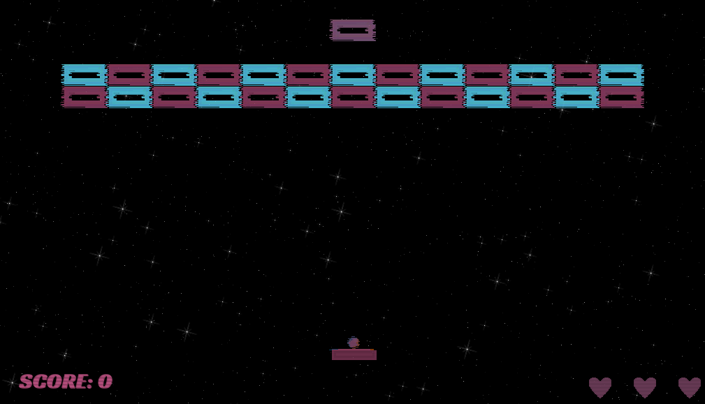

## BLOCKY

a breakout style game using godot engine.

In this game your goal is to break all the bricks before you run out of lives.

This was done as a practice project to get used to godot engine. 
I also did a few shaders in this project. 
Feel free to copy any code you want.

Here you can download the stuff you need to try it on [windows](downloads/win/)  and on [linux](downloads/linux/).

The game is very short but there is a special mechanic in level 2: 
if you shoot a color changing block (the one where the color changes all the time)
your ball and paddle will change color and you can now only destroy bricks of that color.

## Screenshots:

## HAVE FUN!
